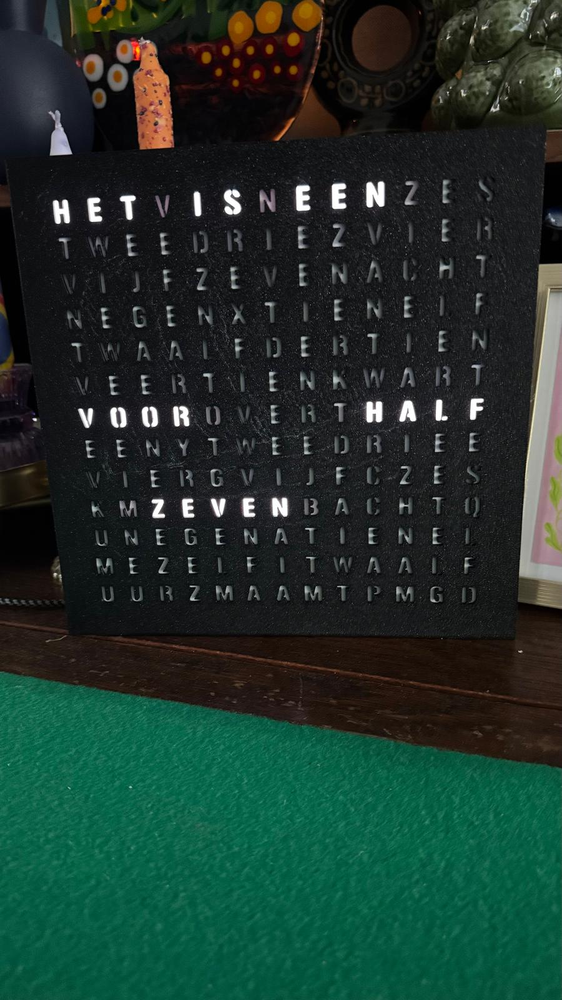

This is my first major project. 

I made a word clock from scratch, build the 3d files with fusion 360, printed on a bambu A1. 
The firmware for the ESP32-C3 is written in ESPhome, on the photo's the time isn't right. in the repo from the firmware these and a few minor bugs where solved. 

